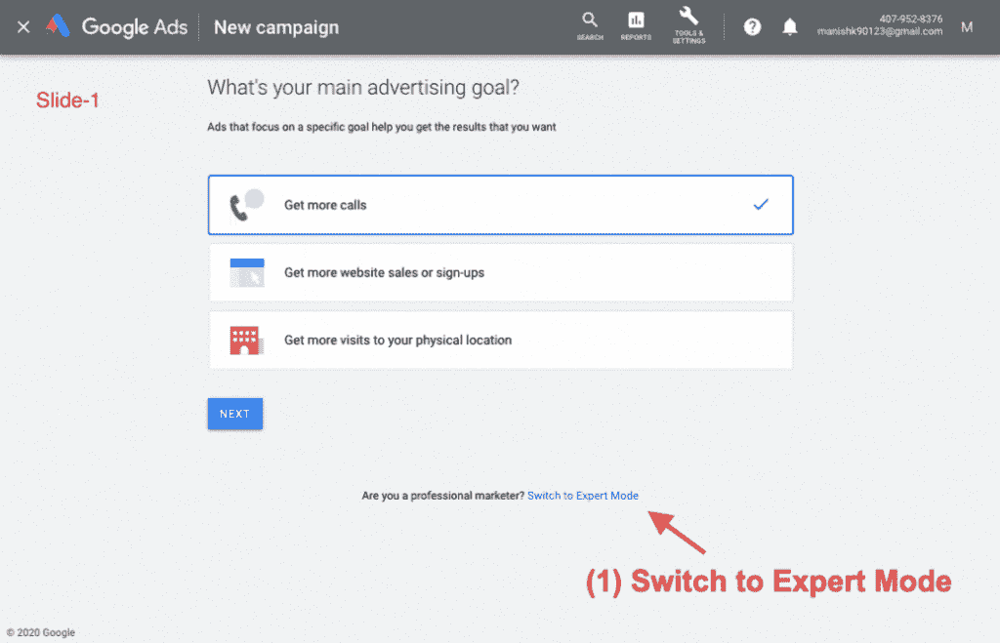

# 搜索引擎优化-关键词研究和规划工具

> 原文：<https://tutorialsclass.com/seo-keywords-research-planning-tools/>

[关键词](https://tutorialsclass.com/seo-keyword-analysis/)调研&策划是分析人们用来在互联网上找到你的网站或内容的流行词汇和句子的过程。

我们做一个网站，重点是想为用户提供什么。我们经常跳过分析人们在搜索引擎上寻找什么和使用什么关键词。这是大多数企业和初创公司网站无法获得流量的主要原因。

关键词研究是搜索引擎优化和数字营销的一个重要实践，可以筛选出有用的关键词，这样你就可以专注于网站上正确的内容。

* * *

### 关键词研究和规划的好处:

*   如果你脑子里有这么多关键词，它会帮助你入围平均月搜索量较高的关键词。
*   一旦有了热门关键词，写内容的时候就可以重点关注了。
*   你可以在主页上展示在搜索引擎中更受欢迎的产品和服务。
*   由于我们有限的 SEO 标题和描述长度，关键字研究将帮助我们选择最佳的关键字。
*   如果没有关键词分析，大多数在线营销活动都没有瞄准准确的受众，因此会失败。
*   关键词研究提供了一个关于你的目标关键词成本的估计
*   这项研究表明，如果短或长尾关键字将最适合我们的网站。例如，您可以了解一些与您的业务或产品相关的常见问题。
*   关键词研究也有助于识别在线竞争。
*   你甚至可以根据地点或国家找到关键词流行度。

* * *

### 关键词研究和规划工具

有许多在线工具可以帮助我们研究和规划关键词。这些工具为关键字和**提供**平均流量，为来自谷歌、亚马逊、YouTube、必应、雅虎和其他社交网络的关键词**提供建议。**

**热门关键词研究工具:**

*   [谷歌关键词规划器](https://ads.google.com/intl/en_in/home/tools/keyword-planner/)(免费)–发现关键词创意或查看关键词的平均搜索量
*   [关键词工具](https://keywordtool.io/)–查找关键词，分析竞争对手，查看搜索量
*   [Wordtracker 关键词研究](https://www.wordtracker.com/)–为您的市场寻找新关键词
*   [Moz 关键词浏览器](https://moz.com/explorer)-研究超过 5 亿个流量驱动关键词。
*   [Ahrefs 关键词浏览器](https://ahrefs.com/keywords-explorer)–发现数千个伟大的关键词创意，分析它们的排名
*   [SEMRush 关键字研究](https://www.semrush.com/features/keyword-research/)–关键字研究
*   [谷歌趋势](https://trends.google.com/trends/)–探索热门术语或话题

一些工具如谷歌关键词规划器从他们自己的数据库中获得大部分数据，而一些如 T2 关键词浏览器从第三方数据库中获得数据。这些工具中的大部分都提供免费访问，但功能或路径规划有限。

我们建议您使用谷歌关键词规划器，您可以使用 Gmail 帐户访问它。使用**发现关键词创意**，您可以看到您的关键词的平均每月搜索数据以及关键词建议(见下面的截图)。

#### 如何免费使用谷歌关键词规划工具:

如果你是一个初学者，你可能会发现很难进入谷歌关键字规划没有 Adwords 运动。以下是步骤:

1.  使用 Gmail 帐户登录 Adwords[https://ads.google.com/](https://ads.google.com/)。
2.  如果您是第一次登录，请点击**“切换到专家模式”**。
3.  点击**“创建一个没有活动的账户”**链接。
4.  继续下一步，点击**工具&设置>规划>关键词规划**
5.  点击**“发现新关键词”**获取关键词建议。
6.  现在你可以输入带逗号的关键字，如果需要还可以改变位置。
7.  **输入**，查看月均搜索量，做**“关键词研究&分析”**。
8.  所有这些步骤在下面的动画图片中很快就涵盖了。

<figure class="wp-block-image size-large border">

<figcaption>Google Keyword Planner</figcaption>

</figure>