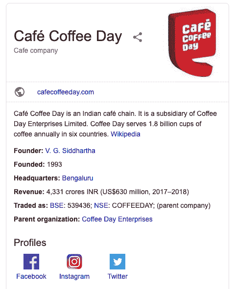
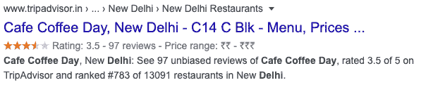

# SEO——结构化数据和模式标记

> 原文：<https://tutorialsclass.com/seo-structured-data-schema-markup/>

结构化数据是 Google 容易理解的标准代码格式。它也被称为模式标记。你也可以称之为搜索引擎的语言。

2012 年，谷歌和其他主要搜索引擎(如必应和雅虎)同意支持标准标记。这种代码结构比传统的 HTML 稍微复杂一点，但是更容易被搜索引擎抓取。

* * *

### 结构化数据对 SEO 的好处:

结构化数据或模式标记是 SEO 专业人员提高搜索引擎可见性的强大而先进的工具。

大多数情况下，我们使用 HTML 标签来显示或组织网站内容。例如，`<h1>apple</h1>`告诉浏览器将文本“Apple”显示为标题。然而，HTML 标签没有提供太多关于“苹果”的信息，因为这可能指的是苹果公司或苹果水果。在这些情况下，搜索引擎会在网页上寻找其他内容来找出相关性。这个过程使得搜索引擎很难向用户显示相关内容。

结构化数据使搜索引擎很容易理解内容的类型。如果你的网站有结构化数据，你的内容可以在搜索引擎结果列表中以一种吸引人的方式呈现。

* * *

### 架构标记格式:

目前，[Schema.org](https://schema.org/)支持的三种格式是微数据、RDFa 和 JSON-LD 标记。

<figure class="wp-block-table">

| 格式 | 描述 |
| JSON-LD | JSON-LD 代表链接数据的 JavaScript 对象符号。这是嵌入在页面头部或主体的 |
| 微观数据 | HTML 微数据代码包括新的 HTML 属性，以便在 HTML 文档中嵌入简单的机器可读数据。 |
| RDFa | RDFa 是 HTML5 的扩展，它为不同类型的数据(如地点、事件、食谱和评论)提供了标记结构。RDFa 可以用在 HTML 页面的头部和主体部分。 |

</figure>

与 RDFa 和微数据相比，Google 建议对结构化数据使用 JSON-LD 。

* * *

### 架构支持的内容类型

模式标记支持多种类型的内容。以下是一些最流行的模式类型:

*   事件
*   方法
*   制品
*   回顾
*   文章
*   人
*   书
*   面包屑
*   当地商业

* * *

### 模式标记及其表示的示例:

#### 组织架构:

这对于诸如学校、非政府组织、俱乐部、公司等组织是有用的。您可以在这里提供公司名称、网站、地址、联系人和其他详细信息。

```
<script type="application/ld+json">
{
  "@context": "http://schema.org/",
  "@type": "Organization",
  "name": "Café Coffee Day",
  "url": "http://www.cafecoffeeday.com/",
  "address": {
    "@type": "PostalAddress",
    "addressLocality": "Paris, France",
    "postalCode": "F-75002",
    "streetAddress": "38 avenue de l'Opera"
  },
  "email": "contact@company.com",
  "telephone": "( 33 1) 42 68 53 00"
}
</script>
```

下面是 Google 中组织模式表示的示例。

<figure class="wp-block-image border">[](https://tutorialsclass.com/wp-content/uploads/2020/02/org-schema-type-example-1.png)</figure>

* * *

#### 评级或检查架构演示:

<figure class="wp-block-image border">[](https://tutorialsclass.com/wp-content/uploads/2020/02/rating-review-schema-example-1.png)</figure>

* * *

#### 事件模式演示:

<figure class="wp-block-image border">[](https://tutorialsclass.com/wp-content/uploads/2020/02/google-schema-event-example-1.png)</figure>

* * *

### 模式生成器和测试工具列表:

作为一个数字营销或 SEO 的家伙，如果你没有编程知识，为你的网站编码结构数据是不容易的。但是，如果你熟悉基本的 HTML 页面结构，你可以使用下面的工具来生成模式，并将其用于你的网站。

*   [模式标记生成器(JSON-LD)](https://technicalseo.com/tools/schema-markup-generator/)
*   [用于 SEO 的 JSON-LD 模式生成器](https://hallanalysis.com/json-ld-generator/)
*   [结构化数据测试工具](https://search.google.com/structured-data/testing-tool/u/0/)
*   [WP SEO 结构化数据模式](https://wordpress.org/plugins/wp-seo-structured-data-schema/)

* * *

### 流行的 WordPress 模式插件列表:

如果你正在使用 WordPress(最流行的网站内容管理系统)，你可以查看下面的插件，这些插件可以让我们轻松地创建模式内容。

*   [模式–全在一个模式中丰富的片段](https://wordpress.org/plugins/all-in-one-schemaorg-rich-snippets/)
*   [模式](https://wordpress.org/plugins/schema-and-structured-data-for-wp/)
*   [模式&WP&AMP](https://wordpress.org/plugins/schema-and-structured-data-for-wp/)的结构化数据
*   [WP SEO 结构化数据模式](https://wordpress.org/plugins/wp-seo-structured-data-schema/)

* * *

### 重要链接:

下面是一些有用的教程，可以让你了解更多关于结构化数据和模式标记的知识:

*   [了解结构化数据的工作原理](https://developers.google.com/search/docs/guides/intro-structured-data)
*   [什么是模式标记&为什么它对 SEO 很重要](https://www.searchenginejournal.com/technical-seo/schema/)
*   [如何使用模式标记提升你的搜索引擎优化](https://neilpatel.com/blog/get-started-using-schema/)
*   [Schema.org 加价](https://moz.com/learn/seo/schema-structured-data)
*   [模式标记最佳实践——Json-LD 与微数据](https://www.envigo.co.in/blog/seo/schema-markup-best-practices-json-ld-vs-microdata)