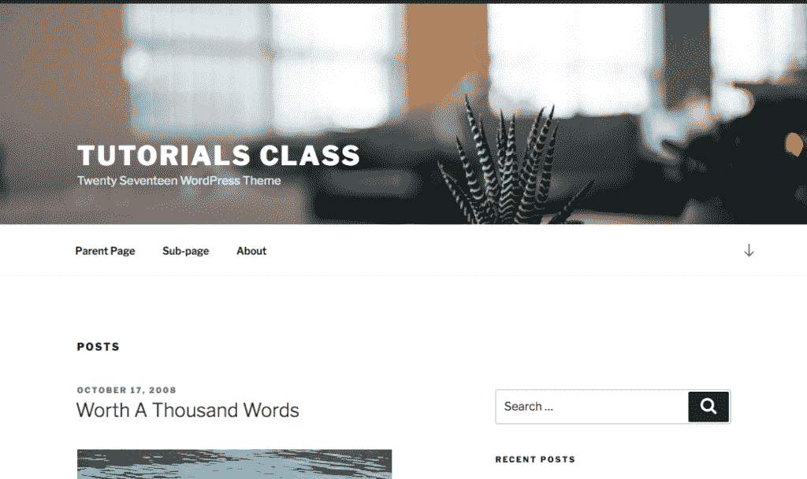
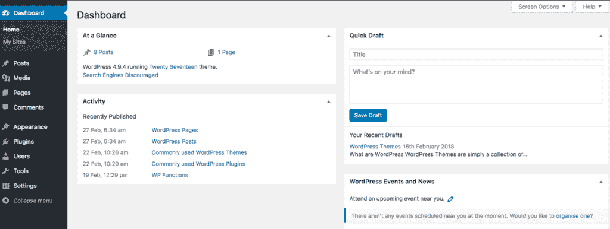

# WordPress 前端和后端

> 原文：<https://tutorialsclass.com/wordpress-frontend-backend/>

因为 WordPress 是一个内容管理系统；它允许我们管理(创建和修改)网站内容。

WordPress 在哪里管理其内容？答案是:使用“WordPress 后端”

* * *

一枚硬币的两面:
成功安装后，我们得到了 WordPress 的两面:前端和后端。一个用于管理内容，另一个用于显示内容。

换句话说，WordPress 后端指的是我们管理网站内容的管理区域。前端是主网站，用户可以在这里看到内容。

熟悉这两个术语的细节很重要，因为我们在使用 WordPress 时经常会用到它们。这些术语不仅适用于所有的 WordPress 站点，也适用于市场上的大多数 CMS。

* * *

### WordPress 前端:

前端是用户访问您的网站时可以看到的区域。例如，当你的网站访问者访问“www.your-site.com”时，他们正在与前端部分进行交互。

WordPress 前端主要由你的网站设计和终端用户的不同种类的内容(页面，内容，菜单等)组成。

<figure class="wp-block-image size-large border"></figure>

* * *

### WordPress 后端(管理/仪表板):

后端是授权用户可以登录和管理网站内容的管理区域。WordPress 后端也被称为仪表板和管理面板。

WordPress 用户可以有不同类型的角色。基于他们的角色，管理员/用户可以创建和修改不同类型的内容。

你可以通过输入你的网址和“/WP-admin**”**来访问 WordPress 仪表盘。比如“www.your-site.com/wp-admin”。

<figure class="wp-block-image size-large border"></figure>

* * *

我们将在下一章学习 WordPress 仪表盘工具。