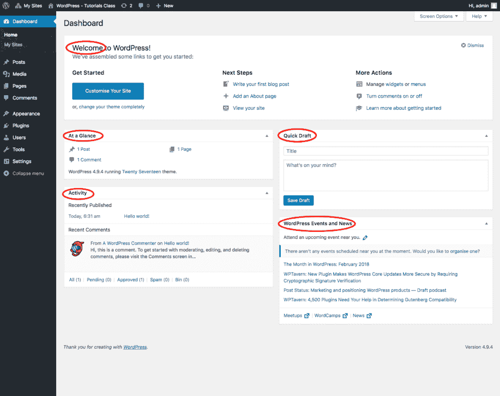

# WordPress 仪表板屏幕

> 原文：<https://tutorialsclass.com/wordpress-dashboard-screen/>

在本教程中，我们将提供 WordPress 仪表盘屏幕的概述。它也被称为 WordPress 管理面板和后端。

WordPress dashboard 使你能够控制你网站的内容。它提供了对仪表板区域内各种内容管理工具的访问。一旦你熟悉了仪表板，你会发现即使你只是一个初学者，管理你的网站也很容易。

* * *

### 登录 WordPress 仪表盘:

你可以使用 WordPress 安装过程中使用的用户名和密码登录到 WordPress 仪表盘区域。你可以通过输入你的网址和“/WP-admin**”**找到登录页面。例如，“www.your-site.com/wp-admin”

一旦你登录，你进入仪表板，上面写着，“欢迎使用 WordPress”。这是 WordPress dashboard 主页部分的一个欢迎部件。这个欢迎屏幕为您提供了一些快速链接。

* * *

### WordPress 仪表板屏幕:

WordPress 仪表板屏幕页面显示当前网站的概述。它显示了你的博客上发生的事情的摘要，并为你提供了一些快速工具，如创建快速草稿和处理最近的评论。

<figure class="wp-block-image size-large"></figure>

在 WordPress 中，这些内容块通常被称为小部件。WordPress dashboard home 主要由以下部件和部分组成。

**[欢迎:](https://codex.wordpress.org/Dashboard_Screen#Welcome)**

欢迎窗口小部件显示一些最常见的 WordPress 任务链接。

**[一览:](https://codex.wordpress.org/Dashboard_Screen#At_a_Glance)**

“一览”小部件提供了网站内容的摘要，如帖子、页面和评论的数量。它们以链接的形式显示，这样你只需点击这些链接就可以进入特定的区域。

**[活动:](https://codex.wordpress.org/Dashboard_Screen#Activity)T3】**

这个小部件用于显示最近发布的帖子、即将发布的预定帖子以及您网站上的最新评论。您可以在此处批准、回复和取消批准评论。

**[快速草稿:](https://codex.wordpress.org/Dashboard_Screen#Quick_Draft)**

快速草稿小部件用于快速编写一些新内容。您可以输入文章标题、上传/插入媒体、添加内容、添加标签。此后，可以将其发布或保存为草稿，以备将来发布。

**[新闻:](https://codex.wordpress.org/Dashboard_Screen#WordPress_News)**

WordPress 新闻窗口小部件提供了官方 WordPress 博客和其他相关网站的最新新闻列表。它还列出了与 WordPress 相关的事件、公告和会议。

在接下来的几章中，我们将逐步学习更多关于仪表板工具的知识。