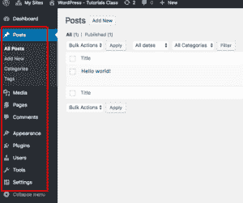

# WordPress 仪表板概述

> 原文：<https://tutorialsclass.com/wordpress-dashboard-overview/>

WordPress dashboard 允许你管理你网站的内容。在本教程中，我们将快速了解 WordPress dashboard 管理区中可用的各种工具。

<figure class="wp-block-image"></figure>

* * *

**Dashboard–Home:**
这个页面显示了 WordPress 内容的概述。

仪表板-更新:
这个页面显示 WordPress，Themes &插件的更新。如果有，您可以在同一页面上更新它们。

* * *

**帖子–所有帖子:**
这个页面显示了你现有的 WordPress 帖子列表。对于每个帖子，都有一个选项/链接来编辑、删除或查看帖子内容。

什么是 WordPress 帖子？帖子是博客的主要元素(或内容)之一。帖子可以被视为关于某个主题的文章、新闻或信息更新。可以使用类别和标签来组织博客文章。

**帖子–添加新的:**
这允许你在 WordPress 中添加新的帖子。您可以输入标题和内容，并为其分配一些类别和标签。您还可以选择向公众发布这篇文章，或者使用状态菜单将其保存为草稿，以便将来发布。

**文章–类别:**
您可以为文章添加新的类别。您可以输入类别标题和描述。

**文章–标签:**
这允许你给文章添加新标签。您可以输入标签标题和描述。标签就像是内容的重要关键词。

* * *

**媒体库:**
媒体库是存储图像、文档、音频、视频和其他文件等所有媒体的地方。此媒体列表将为您提供编辑或删除现有媒体文件的选项。

**媒体–新增:**
在这里，您可以上传新的媒体文件，用于添加帖子/页面的内容。

* * *

**页面–所有页面:**
此部分显示您现有的 WordPress 页面列表。对于每个页面，您都有一个选项/链接来编辑、删除或查看帖子内容。

什么是 WordPress 页面？页面是与帖子类似的另一个重要元素(或内容)。您可以用同样的方法在页面中输入标题&内容。然而，页面用于静态类型的内容，例如关于页面、联系页面、隐私政策和条款&条件。他们不需要与内容相关的类别和标签。

**页面–所有页面:**
这个部分允许你在 WordPress 中添加新页面。您可以输入页面的标题和内容。您还可以选择向访问者发布此页面，或者使用状态菜单将其保存为草稿，以便将来发布。

* * *

**页面–评论:**
WordPress Dashboard 评论区允许你查看、评论、删除或回复用户对你文章内容的评论。

* * *

**外观–主题:**
使用主题部分，您可以查看或切换主题。顾名思义，主题指定了网站的设计。你也可以在这里安装新的主题。

什么是 WordPress 主题:
WordPress 主题定义了你网站的外观&功能。主题文件夹主要由样式表、JavaScript、图片和 PHP 文件组成。

**外观-定制:**
使用定制部分，你可以定制你的主题的外观和感觉。在 Customise 里面，你也可以放置和管理一些内容。

**外观–Widgets:**
WordPress Widgets 部分允许你在你的网站上设置 Widgets 内容。你可以将 WordPress 小部件添加到你的主题定义的侧边栏区域。例如，你在左边&右边栏看到的大部分内容来自 WordPress 网站上的小工具。

什么是 WordPress Widgets
WordPress Widgets 是一些小模块，用来给你的网站增加额外的内容和功能。大多数时候它们被用于侧边栏的页脚区，但是它们也可以用在其他地方。

WordPress 有很多小工具。可用小工具的一些内容是类别、菜单、标签云、搜索、音频和图像，您可以在您的网站上使用它们。

**外观–菜单:**
WordPress 提供了内置的菜单部分。你可以创建一个菜单&在那些菜单中添加 WordPress 内容链接。你也可以在菜单中添加文章、类别、页面甚至自定义链接。菜单部分还允许您修改任何菜单链接、标签。你甚至可以通过拖拽&来对菜单项进行排序。

什么是 WordPress 菜单
菜单是用来在 WordPress 站点上建立导航菜单的。导航菜单在网站上非常流行，因为它们允许用户轻松地浏览网站页面。大多数主题都支持在网站上显示一个或多个菜单。