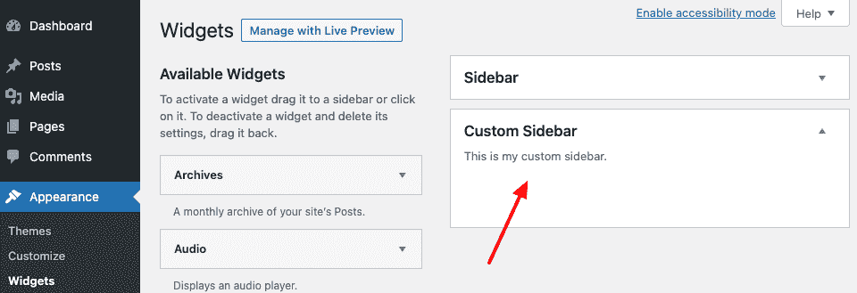

# 注册侧边栏

> 原文：<https://tutorialsclass.com/wordpress-register-sidebar/>

侧边栏是 WordPress 网站上你可以放置小部件的地方。

WordPress 主题也可以有多个侧边栏。大多数 WordPress 主题都支持右侧和页脚的侧边栏区域，但是它可以根据你的网站设计需求创建在任何地方。你可以在左侧注册侧边栏，如果你想在那里放置一些小部件，甚至可以在标题中注册。另外，在每个主题中注册侧边栏并不是强制性的。

* * *

## 如何创建边栏:

您可以使用`*register_sidebar()*`功能创建或注册侧边栏区域。应该使用 *`widgets_init`* 钩子来调用这些函数

### 参数:

*   **name**–你在工具条上的名字。这是用户将在小部件面板中看到的名称。
*   **id**–它应该是唯一的，小写的，将在`dynamic_sidebar`()函数中使用，以调用主题中的侧边栏。
*   **描述**–侧边栏描述在 Widgets 面板中可见。
*   **class**–分配给小部件 HTML 的 CSS 类名
*   **before _ widget**–在每个 widget 之前插入的 HTML，如`<aside>`或`<div>`标签
*   **after _ widget**–在每个小部件后插入 HTML。关闭插入的标签`before_widget`
*   **before _ title**–HTML 来插入每个小部件的标题，比如一个`<h3>`标签
*   **after _ title**–在每个标题后插入 HTML。在 _title 前插入关闭标签，如`</h3>`

* * *

### 注册侧栏的示例:

```
/* Register your 'custom' sidebar. */
add_action( 'widgets_init', 'my_custom_sidebars' );
function my_custom_sidebars() {
    register_sidebar(
        array(
            'id'            => 'custom_sidebar',
            'name'          => __( 'Custom Sidebar' ),
            'description'   => __( 'This is my custom sidebar.' ),
            'before_widget' => '<div id="%1$s" class="widget %2$s">',
            'after_widget'  => '</div>',
            'before_title'  => '<h3 class="widget-title">',
            'after_title'   => '</h3>',
        )
    );
    /* Repeat register_sidebar() code for multiple sidebars. */
}
```

* * *

### 仪表板中注册的边栏:

一旦侧边栏被注册，你就可以在 [WordPress 仪表盘](https://tutorialsclass.com/wordpress-dashboard-overview/)【外观>小工具中找到侧边栏区域。您可以轻松地将可用的小部件放置在侧边栏中。

<figure class="wp-block-image size-full is-resized border"></figure>

* * *

## 在主题中显示边栏:

现在，您想在您的主题或网站中显示侧边栏小部件。找出哪个部分或页面应该在你的主题中包含注册的侧边栏。它可以是 header.php，sidebar.php，footer.php 或任何其他模板文件根据您的要求。

你需要使用 WordPress 函数`dynamic_sidebar($id);`在主题中显示你的自定义侧边栏部件。这里有一个例子:

```
 <div id="custom-sidebar" class="sidebar">
    <?php dynamic_sidebar( 'custom_sidebar' ); ?>
</div>
```

因为我们已经用唯一的 id‘custom _ sidebar’创建了侧边栏，所以我们通过在 WordPress 函数中传递相同的 id 来调用侧边栏。你可以根据你的特性使用任何侧边栏 id，但是要确保它在你的主题中是唯一的。为了避免与任何插件小部件冲突，您也可以使用一些前缀。