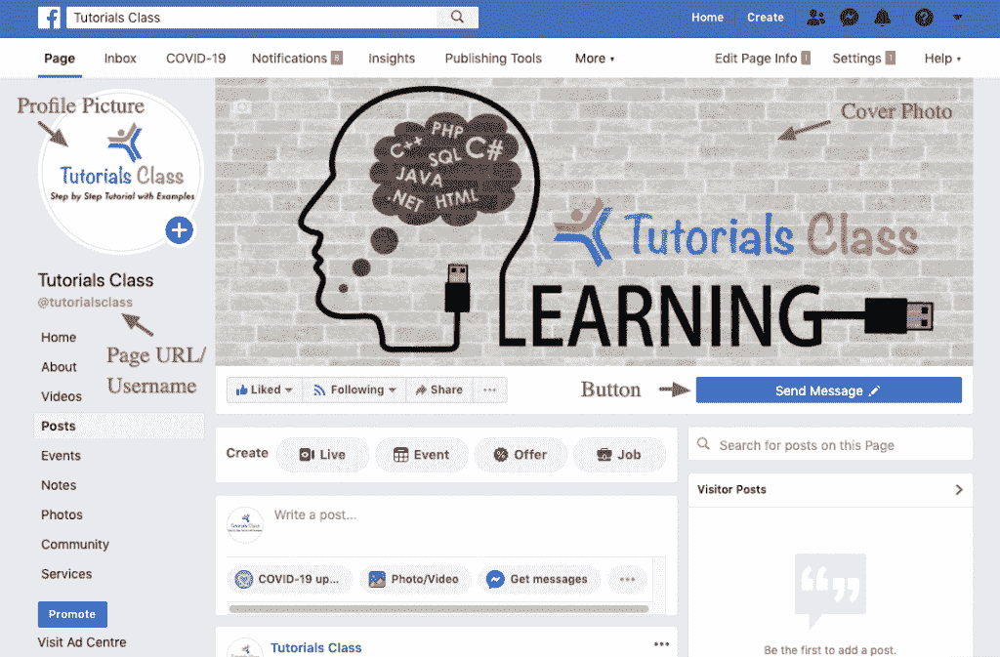
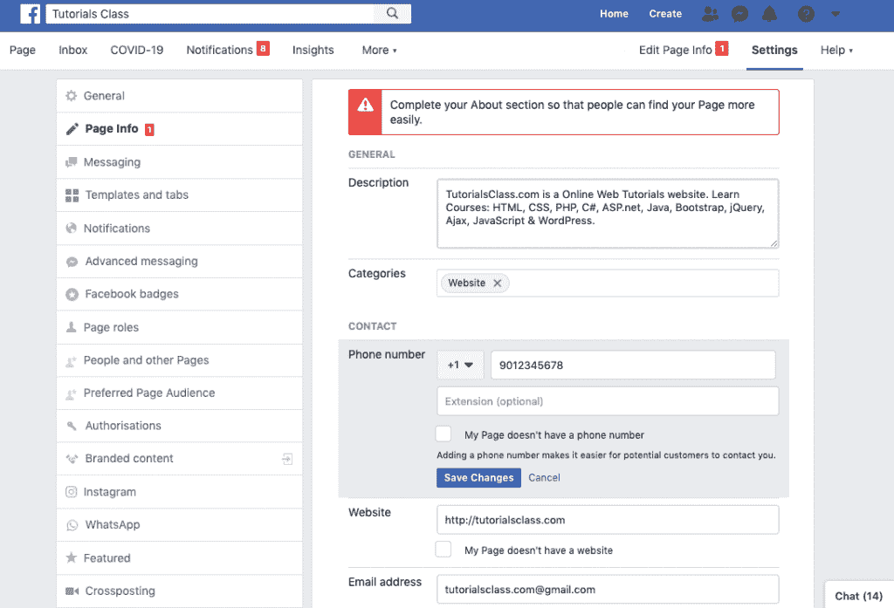

# SMM–创建脸书页面

> 原文：<https://tutorialsclass.com/smm-create-facebook-page/>

#### 什么是脸书页面

[脸书页面](https://tutorialsclass.com/smm-facebook-marketing/)是企业、品牌、组织和艺术家与他们的追随者或客户联系的公共档案。页面用于分享他们的故事、事件和其他信息。喜欢或关注某个页面的人可以收到他们的帖子更新。

* * *

#### 为什么是脸书·佩奇而不是简介？

我们大多数人都在脸书上注册并创建了个人资料，以便与朋友、家人和其他人联系。但是不建议用你的个人资料做营销。你应该为营销创建一个脸书网页，主要有两个原因:

1.  通过使用脸书页面，您可以使您的个人信息和内容远离公众。
2.  脸书网页是专门为商业设计的，因此它有许多对商业有用的功能。

* * *

### 如何为企业创建有效的脸书页面？

在这一部分，我们将了解脸书网页制作。要创建一个有效的脸书页面，你需要在所有(或重要部分)填写信息，如页面类别，个人资料图片，封面照片，网站，描述，地址和其他。

<figure class="wp-block-image size-large border">

<figcaption>**Facebook Page Sections**</figcaption>

</figure>

许多人通过快速添加最少的信息来创建一个页面，他们会考虑以后更新其他部分。不幸的是，要么你后来没有时间，要么完全忘记了。

例如，如果你忽略了你的公司地址或联系方式，许多客户将无法通过你的页面与你联系。因此，如下所述，注意重要的页面部分是很重要的。

* * *

### **打造完美脸书页面的步骤:**

#### 1.创建脸书页面

在这里创建一个脸书页面:**【https://www.facebook.com/pages/create】**

#### 2.选择页面类别

如果你处理产品和服务，选择**业务或品牌**，如果你想联系人、团队或团体，选择**社区或公众人物**作为页面类别。

#### 3.选择页面名称和相关类别

在这里，您将提到适当的页面名称，并选择一个与您的业务、品牌或社区相关的类别。

#### 3.上传个人资料图片和封面照片

确保你上传了一张好的个人资料照片和封面照片。您可以拍摄带有徽标或标语的个人资料图片。同样，封面照片可以有一个标志，标语，或一些关于你的产品和服务的信息。

**个人资料图片大小:** [脸书页面个人资料图片](https://www.facebook.com/help/125379114252045)在电脑上显示为 170×170 像素，在智能手机上显示为 128×128 像素，在小型设备上显示为 36×36 像素。为了获得最佳效果，您需要上传一个正方形图像，如 360×360、720×720 或 960×960。

**封面照片尺寸:** [脸书封面照片](https://www.facebook.com/help/125379114252045)在电脑上显示为 820×312 像素，在智能手机上显示为 640×360 像素。为了获得最佳效果，您可以选择 820×360 像素的最小图片尺寸。

恭喜你！您的页面已成功创建。

* * *

### 如何填写脸书页面信息和详情:

现在，您可以在不同的部分添加页面相关信息。这很重要，因为如果任何用户想了解你的业务、产品、社区或服务，你的页面上就应该有。

**以下是填写页面信息的重要部分列表:**

#### 添加按钮:

您可以在这里选择适合您页面的按钮标签和链接。使用此按钮，人们可以从您的页面采取行动。您可以添加带有不同标签的网站或应用程序链接，如“了解更多”、“立即购买”和“立即预订”。

#### 编辑页面信息:

**描述**:添加一个 255 个字符以内的关于你的页面、产品或服务的简短摘要。

**类别**:如果与你的页面相关，你可以选择多个类别。

**联系人**:在这里，您可以添加电话号码、电子邮件、地址、服务区域、产品、营业时间以及类似的详细信息。

<figure class="wp-block-image size-large border">

<figcaption>Facebook – Edit page info</figcaption>

</figure>

**模板和标签**:在这里你为你的脸书页面选择一个合适的模板设计。您还可以添加和排序标签，如帖子、活动、评论、商店、优惠和视频。

**设置一个**脸书页面网址**** :点击个人资料图片下的**“创建页面@用户名”**可以创建一个相关的和 [SEO](https://tutorialsclass.com/seo-urls/) 友好的网址。它也被称为虚荣心网址。这不仅有助于你的网页在搜索引擎中的排名，还能让你更容易记住网页的网址。

有时，当你有至少 25 页的赞时，你只能设置一个页面 URL。还有就是只能换一次，所以要根据自己的品牌、业务或者社区来慎重选择。这些指导方针可能会随着时间的推移而改变，因此您可以遵循[脸书指导方针](https://www.facebook.com/help/409473442437047?page=900)获取最新信息。

**其他:**如果您想添加更多信息，还有更多的部分，如 WhatsApp 按钮、添加不同角色的用户等。

* * *

通过注意以上所有的事情，你可以创建一个完美的页面，让你的客户可以找到他们想要的信息。在接下来的教程中，我们将学习创建有效帖子来吸引客户的技巧。