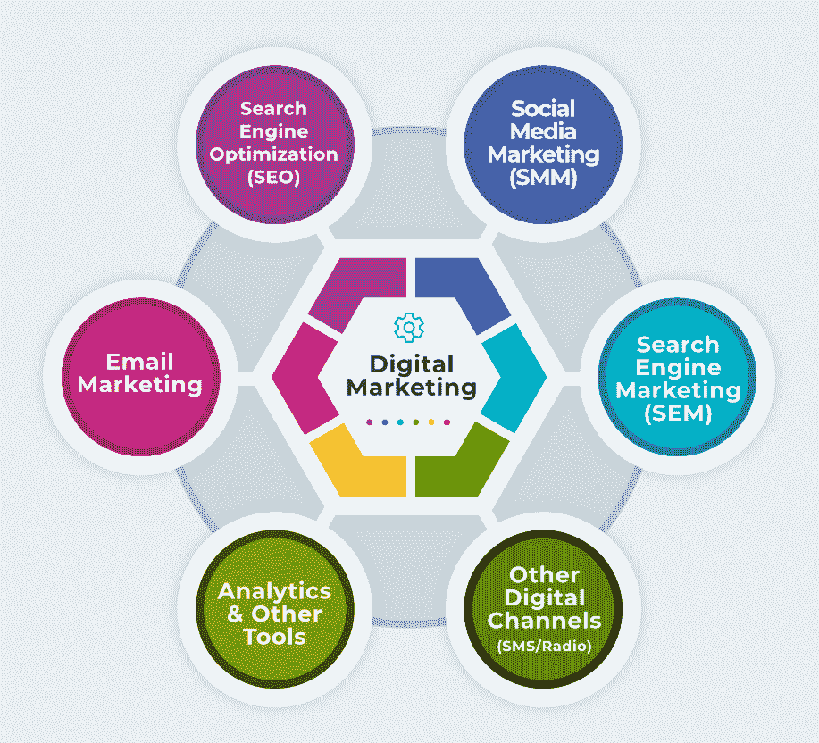

# 数字营销简介

> 原文：<https://tutorialsclass.com/digital-marketing-introduction/>

数字营销是指利用互联网技术和其他数字平台(如短信、电视和广播)为产品和服务做广告。

### 数字营销涵盖了哪些内容？

**数字营销** **(DM)** 包括不同渠道的组合，如搜索引擎、社交媒体、网络应用、移动应用、电子邮件、短信和其他数字渠道。

有时数字营销，互联网营销和网络营销术语可以互换使用。然而，数字营销是一个更广泛的术语，因为除了基于互联网的渠道之外，它还包括其他数字渠道(调频、电视)。

<figure class="aligncenter size-full is-resized">

<figcaption>Digital Marketing – Channels</figcaption>

</figure>

* * *

我们可以将数字营销主要分为**四个**子集:

### 1)搜索引擎优化

[搜索引擎优化](https://tutorialsclass.com/seo-introduction/) (SEO)就是提高网站在搜索引擎的有机结果列表中的可见性的过程。

**SEO 示例:**当你对你的网站标题、标题、内容等进行处理，以使谷歌和其他搜索引擎在没有任何付费广告的情况下提高你的网站页面排名。

SEO 与广告没有直接关系，但它为其他营销技术奠定了基础。大多数新业务做付费营销，以帮助搜索引擎的自然能见度。当你的网站获得大量流量时(通过付费营销)，也有助于有机结果。

使用 SEO 为搜索引擎优化你的页面是很重要的，这样你的网站无论有没有付费营销都可以保持增长。

* * *

### 2)社交媒体营销(SMM)

社交媒体营销(SMM)是一种利用社交媒体和社交网络平台推广产品和服务的方式。

在免费技术中，它包括在不同的社交媒体网站上创建个人资料，以及与你的追随者分享内容。

**免费 SMM 示例:**当您通过脸书帖子或推文分享您的产品和服务时。

社交媒体营销还包括通过促销活动创建的付费营销技术。最受欢迎的社交媒体营销平台是脸书、推特、YouTube、Instagram、WhatsApp 和 Pinterest。

**付费 SMM 示例:**当您创建付费脸书或 Twitter 广告活动来推广您的帖子、产品或服务时

* * *

### 3)搜索引擎营销(SEM)

搜索引擎营销是指网站在搜索引擎结果页(SERP)中主要使用付费广告的推广。这也被称为**每次点击付费(PPC)** 你购买和支付广告每用户点击的基础。

**SMM 举例:**当你使用付费的谷歌广告在搜索引擎列表上为你的网站做广告。

SMM 是数字营销的一个重要分支，因为它主要关注广告技术。这种形式的营销还提供了在搜索引擎合作网站上显示和其他类型的付费广告的选项。

* * *

### 4)其他数字频道:

**代销商营销**:在这种营销方式中，代销商(个人或组织)通过推广某人的产品来赚取佣金。

**举例:**在各种 YouTube 拆箱视频的描述中，你都能找到附属链接。当你使用这些链接购买产品时，代销商会得到一些佣金。类似地，在许多提供顶级软件列表的网站中，也包含该软件的附属链接。

电子邮件营销:电子邮件营销是另一种有效的营销技术，它向一群客户发送促销电子邮件。

例:我们经常收到与不同产品和服务相关的商业邮件，有时是以优惠和折扣的形式。

**手机(短信):**批量短信、促销短信、交易短信也可以作为营销中的数字渠道。

**电视、收音机、FM:** 数字营销渠道可能包括这些投放广告的渠道。这些渠道也是传统营销的一部分。

**分析工具:**有许多分析工具可以帮助我们跟踪用户和营销策略。利用它们，我们可以看到哪种平台或广告对我们的推广是有效的。例子包括谷歌分析，搜索控制台，Mailchimp，Sendinblue 等。

**自动化工具:**有很多社交媒体自动化工具可以帮助我们自动发布不同社交媒体网站的内容。例如缓冲液、Hootsuite 等。

* * *

### 数字营销与传统营销:

**传统营销**利用报纸、杂志、电话、街头横幅、小册子做广告。而**的数字营销**主要侧重于数字和基于互联网的渠道。

在下表中，我们将看到与传统营销相比，使用数字营销的各种**优势**。

<figure class="wp-block-table">

| 传统营销 | 数字营销 |
| --- | --- |
| 广告很难锁定相关的受众。 | 你可以根据地点、兴趣、性别、年龄和其他因素选择目标受众。 |
| 报纸、杂志、小册子或街头横幅上的广告包括设计、印刷和发行工作。 | 数字营销广告不需要印刷，并且易于向在线用户分发或显示广告。 |
| 这种形式的营销需要时间来投放广告。 | 您可以在几分钟内快速推广您现有的帖子、服务或产品。 |
| 传统营销成本高昂，任何类型的广告的最低成本都更高。 | 数字营销可以以非常低的价格和总体成本开始。 |
| 你很难跟踪有多少用户看到了你的广告或对你的广告做出了回应。 | 您可以轻松跟踪活动的互动和参与情况。 |
| 一旦一场大型营销活动开始，如果出现问题，你就无法轻易阻止它。 | 您可以随时轻松暂停和恢复营销活动。 |
| 与数字平台相比，传统营销的受众较少，数量也没有增长。 | 社交媒体和在线用户正在快速增长，因此有巨大的用户群可用于营销。 |

</figure>